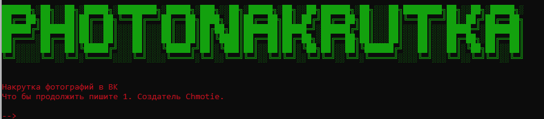

# photo
Накрутка фотографий для ВКонтакте. 

# Установка на Termux
pkg update && pkg upgrade
pkg install git 
pkg install python
git clone https://github.com/mishaQ23n/photo
cd photo 
pip install colorama
pip install vk_api
python main.py
Далее вводим данные и все готово.
Пример работы:
​
